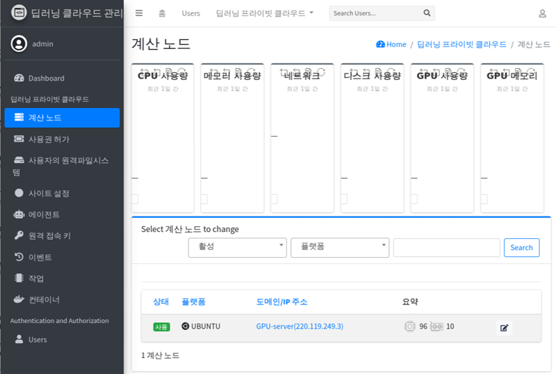
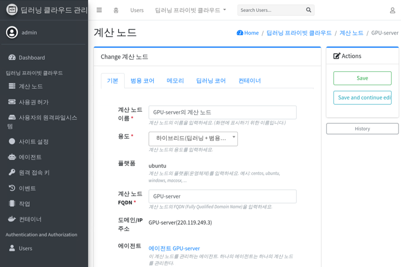

# 계산 노드 관리하기

**시스템 관리** 화면에서 **계산 노드** 메뉴로 이동합니다. 이 메뉴에서는 전체적인 시스템의 사용현황을 보여줍니다.

* **CPU 사용량** 총 CPU 대비 사용률로 표현됩니다. 각 노드의 전체 N개의 CPU에 대한 부하를 총량 100%로 합니다. 선그래프 표현합니다.
* **메모리 사용량** 총 메모리 대비 사용률로 표현됩니다. 각 노드의 총 메모레에 대한 사용(점유)를 총량 100%로 합니다. 선그래포 표현합니다.
* **네트워크** 네트워크 전송량 (Byte)를 표현합니다.

  - 중심에서 상단으로 커지는 것은 계산노드로 데이터가 유입되는 양을 나타냅니다. 선그래프로 높게 표현될 수록 네트워크의 데이터 유입량이 많음을 의미합니다.
  - 중심에서 하단으로 커지는 것은 계산노드에서 외부로 데이터가 나가는 양을 나타냅니다. 선그래프에서 크게 하강될 수록 데이터의 나가는 통신양이 많음을 의미합니다.
  
* **디스크 사용량** 계산노드의 전체 디스크의 사용량을 총량 100%로 하여 표현합니다.
* **GPU 사용량** *CPU 사용량* 과 표현방법은 같습니다. 단, 한번도 GPU를 사용하지 않은 경우, 그래프에 데이터가 나타나지 않을 수 있습니다.
* **GPU 메모리** *메모리 사용량* 과 표현방법은 같습니다. 단, 한번도 GPU를 사용하지 않은 경우, 그래프에 데이터가 나타나지 않을 수 있습니다.

## 개별 계산노드 보기

하단의 *계산 노드* 목록에서 한 서버를 선택하면 보다 상세한 정보를 확인할 수 있습니다.

* **범용코어** CPU의 사용량을 System, User, Idle 및 개별 CPU 별로 그래프로 나타내어 보여줍니다.
* **메모리** 메모리의 사용량을 커널, 애플리케이션, 캐쉬 등의 점유 상태를 그래프로 나타내어 보여줍니다.
* **딥러닝 코어** 개별 GPU의 사용량과 개별 GPU 메모리 사용량을 그래프로 나타내어 보여줍니다.
* **컨테이너** 이 계산 노드에서 실행중인 노트북서버에 해당하는 컨테이너들의 점유 상태를 CPU/메모리 등의 정보로 분할하여 보여줍니다.
