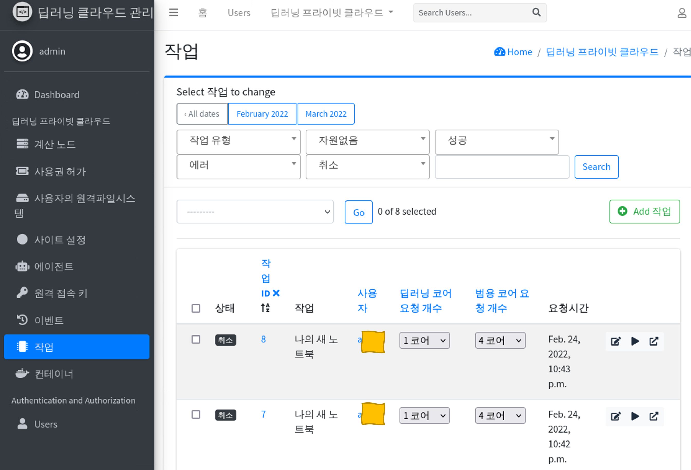
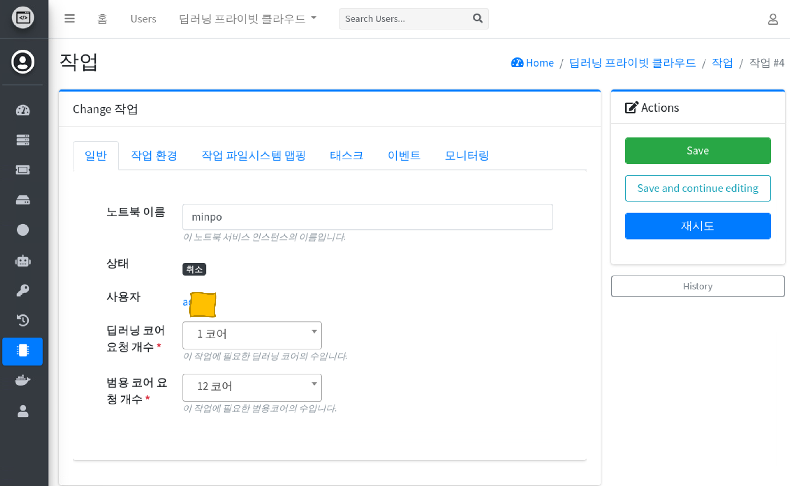

# 노트북 관리하기

**시스템 관리** 에서 **작업** 메뉴로 이동합니다.

* **작업** 은 사용자 화면에서 생성한 노트북 서버를 의미하며, 사용자가 요청한 자원 정보를 변경할 수 있습니다.

  - 목록 메뉴에서 사용자가 요청한 CPU 의 정보를 변경할 수 있습니다.
  - 이 화면에서 변경하는 경우, **사이트 설정**의 동시 사용 CPU 혹은 GPU 의 수의 제한을 넘겨 할당할 수 있습니다.

작업 중 하나를 선택하여, **이름**, **CPU(범용코어)**, **GPU(딥러닝코어)** 의 수를 변경할 수 있습니다.

* **노트북 이름** 노트북 서버의 표기 이름을 변경합니다. 이 이름은 표시 정보외에 다른 것에 영향을 주지 않습니다.
* **상태** 노트북 서버의 상태를 표시합니다.
* **딥러닝 코어 요청 개수** GPU(카드)의 요청 개수를 의미합니다.

  - **사이트 설정**의 제한과 관계없이 변경 가능합니다.
  - 노트북 서버가 실행 중이지 않은 경우, 변경할 수 있습니다.
  - 노트북 서버가 실행 중인 경우에는 변경할 수 없습니다.

* **범용 코어 요청 개수** CPU의 요청 개수를 의미합니다.

  - **사이트 설정**의 제한과 관계없이 변경 가능합니다.
  - 노트북 서버가 실행 중이지 않은 경우, 변경할 수 있습니다.
  - 노트북 서버가 실행 중인 경우에는 변경할 수 없습니다.
  - 계산 노드가 하이퍼스레딩을 사용중이면 하이퍼스레딩된 CPU 단위로 할당합니다.

* **작업 환경** 노트북 서버의 시작시 결정되는 정보를 변경할 수 있습니다.

  - **주의** 사용자 UI 에서 변경하는 것이 좋습니다. UI 버전이 변경될 때, 사용되는 값이 달라 질 수 있습니다.
  - 시작 프로그램: 쥬피터, IDE, 원격데스크탑 을 변경할 수 있습니다.
  - 이미지: 노트북 서버의 동작 이미지를 변경할 수 있습니다.

* **작업 파일시스템 맵핑** 노트북 서버의 사용자의 홈 디렉토리와 연결할 원격 파일 시스템의 정보가 등록되어 있습니다.

  - 만약 이 정보를 삭제하게 되면, 해당 노트북 서버는 사용자의 홈에 저장된 기록을 보존하지 않습니다.

