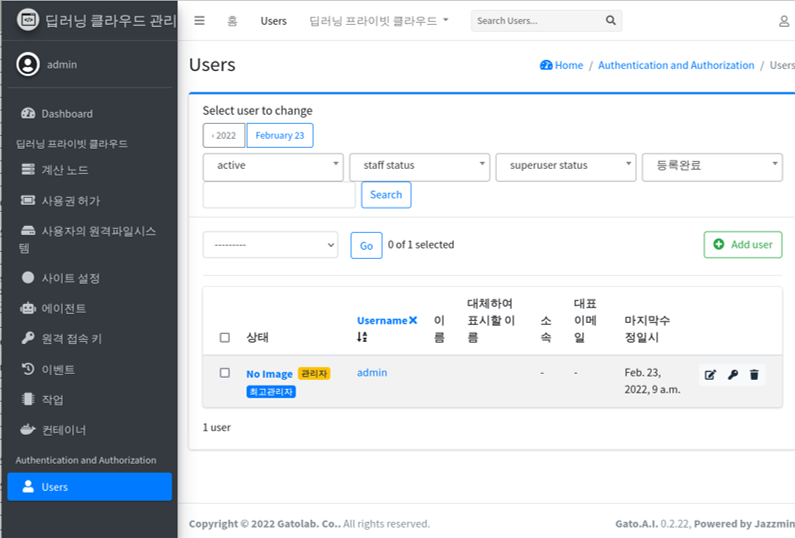
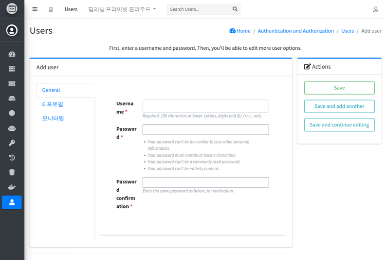
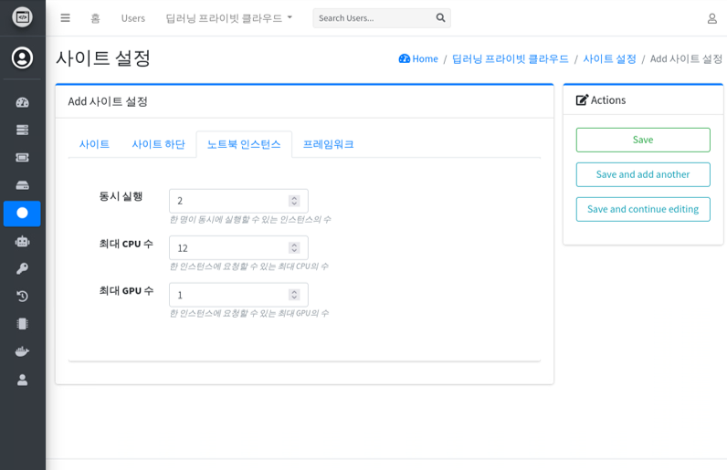

# 사용자 등록

사용자를 등록하기 위해서는 **시스템 관리** 화면으로 이동합니다.



우측 상단의 ```Add user``` 버튼을 누릅니다.



* **Username** 사용자 로그인 이름을 입력합니다.
* **Password** 사용자의 초기 비밀번호를 입력합니다.
  - 비밀번호는 8자 이상이어야 합니다.
  - 비밀번호는 숫자로만 구성할 수 없습니다.
  - 비밀번호는 계정이름과 유사할 수 없습니다. 
* **Password confirmation** Password를 한번더 입력합니다.
* **G프로필** 탭에서 추가적인 사용자 정보를 입력할 수 있습니다.


# 사용자의 동시 사용 제한

한 사용자가 사용할 수 있는 자원을 제한할 수 있습니다.

**사이트 설정** 으로 이동한 후, **노트북 인스턴스** 탭을 선택합니다.



* **동시 실행** 동시에 실행가능한 노트북 서버의 수를 변경합니다.
 - 지정된 수 이상의 서버를 생성할 수 있습니다.
 - 단, 실행가능한 서버는 지정된 값이 초과하는 경우, 초과된 서버는 즉시 실행이 취소됩니다.

* **최대 CPU 수** 한 노트북 서버에 할당할 수 있는 최대 CPU 수를 변경합니다.
 - **Gato A.I. Basic** 에서는 물리적으로 한 서버 연결된 최대 CPU를 초과하는 CPU를 할당할 수 없습니다.
 - 예를 들어, 물리적인 장비에 32개의 CPU가 있는 경우, 최대 값을 48개로 지정하는 경우, 서버는 생성할 수 있으나, 스케줄링되지 않습니다.
  
* **최대 GPU 수** 한 노트북 서버에 할당할 수 있는 최대 GPU 수를 변경합니다.
 - **Gato A.I. Basic** 에서는 물리적으로 한 서버 연결된 최대 GPU를 초과하는 GPU를 할당할 수 없습니다.
 - 예를 들어, 물리적인 장비에 8개의 GPU가 있는 경우, 최대 값을 10개로 지정하는 경우, 서버는 생성할 수 있으나, 스케줄링되지 않습니다.
